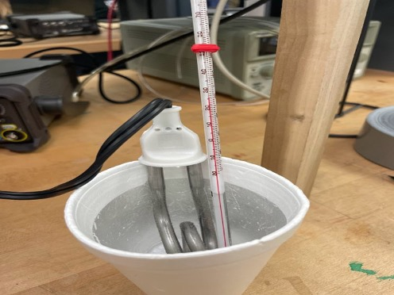
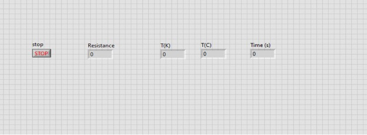
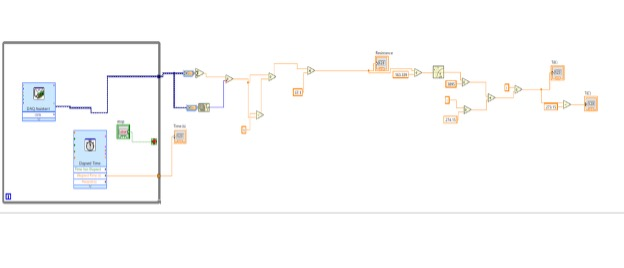

# Saltwater specific heat lab

Instrumentation lab project measuring how saltwater concentration affects specific heat capacity using a thermistor, DAQ voltage measurements, and a LabVIEW data collection VI.

## Overview

This instrumentation lab project measured how saltwater concentration affects specific heat capacity. The experiment used an immersion heater to add energy to a saltwater solution while a thermistor measured temperature continuously through a DAQ and a LabVIEW data collection VI.

## Experimental Objectives

- Measure temperature continuously over time using a thermistor + DAQ + LabVIEW
- Compute specific heat capacity for solutions of different NaCl molalities
- Compare how specific heat capacity changes as molality increases

## Hypothesis

As salt molality increases, the specific heat capacity of the solution decreases due to ionic interactions reducing the amount of energy required to raise the solution temperature.

## Theory and calculations

We modeled the solution + heater as a closed system so electrical energy delivered to the heater is treated as heat added to the fluid over a time interval.

Key relationships:

- Sensible heating: Q = m Cp ΔT
- Electrical power delivered to the heater: P = V^2 / R
- Energy added over an interval: Q = P Δt

Combining these gives the working equation used in this project:

Cp = (V^2 Δt) / (m R ΔT)

## Thermistor measurement and calibration

### Voltage divider (DAQ measurement)

To measure temperature, the thermistor was placed in a voltage divider powered by the DAQ (5 V). A known resistor was used in series (about 68 Ω), and the DAQ measured the divider voltage at the node between the known resistor and the thermistor.

Given the measured node voltage Vout, the thermistor resistance can be computed as:

Rtherm = Rknown \* Vout / (Vin - Vout)

where Vin = 5 V and Rknown ≈ 68 Ω.

### Calibration points

The thermistor was calibrated using known temperature points: 0 °C (ice bath), room temperature (about 22 °C), 80 °C, and 90 °C. Resistance vs temperature data was used to determine the β parameter and build a LabVIEW conversion from measured voltage to temperature.

### Efficiency calibration (baseline)

A baseline calibration was performed using deionized water, using Cp = 4.184 J/g·°C as a reference to account for non-ideal heater efficiency and heat loss.

## Experimental set-up

The system consisted of an immersion heater to add energy to the solution and a thermistor-based measurement circuit to track temperature over time.

- Immersion heater powered by a DC power supply
- Thermistor measured using a DAQ-powered voltage divider (5 V source)
- The heater and thermistor were both placed in the solution during testing
- An insulated container (styrofoam cup setup) was used to reduce heat loss

## Procedure summary

- Prepared solutions at different NaCl molalities and recorded solution mass
- Collected a baseline trial using deionized water to estimate heater efficiency / heat loss
- Logged temperature continuously in LabVIEW while powering the immersion heater for a measured time interval
- Computed specific heat capacity using measured voltage, time interval, mass, and observed temperature change
- Repeated trials across molalities and compared results

## LabVIEW VI

The LabVIEW VI was used to acquire voltage data from the DAQ, convert the measured voltage into thermistor resistance, convert resistance into temperature using calibration parameters, and log temperature over time during each heating run.

Calibration validation was performed by checking measured temperatures against known reference points (ice bath, room temperature, and heated water).

## Project visuals

### Experimental setup

### LabVIEW VI

## Results and discussion

Specific heat capacity was computed for solutions across multiple NaCl molalities using measured electrical energy input and the observed temperature rise over each heating interval. The baseline deionized water trial was used to estimate non-ideal heater efficiency and heat loss so results could be adjusted consistently across runs.

Overall, the results supported the hypothesis that specific heat capacity decreases as molality increases. Deviations from ideal behavior were mainly driven by experimental heat loss, mixing effects, and sensitivity to small temperature changes over short time intervals.

## Repository contents

- docs/presentation/
  - final-presentation.pdf: final project presentation
- docs/weekly-updates/
  - weekly-update-1.pdf
  - weekly-update-2.pdf
  - weekly-update-3.pdf
- labview/
  - Lab Project VI.vi: LabVIEW VI used for DAQ acquisition and temperature conversion
- media/figures/
  - setup-photo.png
  - labview-front-panel.png
  - labview-block-diagram.png

## Tools used

- LabVIEW (data acquisition and temperature conversion)
- NI-USB-6221 DAQ (voltage measurement)
- Thermistor + voltage divider circuit (temperature sensing)
- DC power supply + immersion heater (energy input)

## Collaborators

- [Malachy Meyer](https://www.linkedin.com/in/malachy-meyer/)
- [Mehdi Mrini](https://www.linkedin.com/in/mehdi-mrini-28779627a/)
